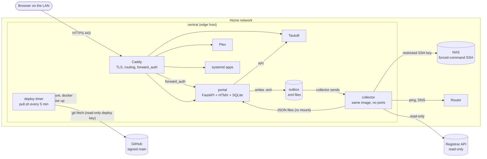

# HAHBAH Homelab

[](https://github.com/wickedhardflip/hahbah-homelab/actions/workflows/ci.yml)
[](LICENSE)

> **A template to learn from and make your own.** This is the working setup behind one person's home network, shared with the personal parts removed. Read it for ideas, or copy it and adapt it:
>
> - **[Make it your own](docs/make-it-yours.md)**: prerequisites, optional integrations, a first-deploy walkthrough, what to replace, rebranding.
> - **[Configuration reference](docs/config-reference.md)**: every setting in one table. Starting points are in [`secrets.example/`](secrets.example/) and [`apps.example.yaml`](apps.example.yaml).
> - **[Security notes](SECURITY.md)**: how it is protected, and what to harden yourself.
>
> **Status:** it runs the author's network every day, but it is a hobby project, not a product. Expect rough edges (see the end of this page) and no support promise. Issues and pull requests are welcome ([CONTRIBUTING](CONTRIBUTING.md)).

A home platform that looks like a subway map. One portal shows every machine, app, mount and drive as a station on a transit line, signs you in once for everything behind it, and tells you in plain language when a line is running late.

Everything here is code and config: the portal, the reverse proxy, the firewall, the monitoring collector and the pull-based deploy that keeps the server in sync with this repo.

## Contents

1. [What it does](#what-it-does)
2. [Architecture](#architecture)
3. [Security model](#security-model)
4. [Design decisions](#design-decisions)
5. [Repo layout](#repo-layout)
6. [Development and tests](#development-and-tests)
7. [Roadmap](#roadmap)
8. [Operations](#operations)

## What it does

### Three views of one snapshot

Map, 3D and NOC all read the same JSON snapshot, so they never disagree. Switch between them with the buttons or the keys `1`, `2` and `3`.

| View | What you get |
|---|---|
| **Map** | A 2D transit map. Machines are interchange stations, apps, mounts and drives are small stations, and the lines are real groupings (internet, web apps, media, storage, backups, drives). Click any station for its card. |
| **3D** | The same map as a hand-drawn city diorama (Three.js, orthographic camera) that folds up from top-down. Rotate with `Q`/`E`. Stadium cards show sports scores, and a weather chip sits in the corner. |
| **NOC** | A plain-language operations console: host panels, edge and domain checks, service tiles, an alarm console with acknowledge buttons, and an interface table. |

A Day and a Midnight theme share one set of CSS tokens.

### Live monitoring

The collector (see [Architecture](#architecture)) and the portal measure:

- **NFS mounts**, every minute, with a probe that a hung mount cannot freeze.
- **Pings** to the router, the NAS and the server, every minute.
- **NAS health** over a restricted SSH key: CPU, memory, RAID, volume usage and temperatures every minute, plus SMART data for the drives once a day.
- **Internet speed**, one test a day, compared with the 7-day median.
- **HTTPS certificate** days left, **domain** expiry and auto-renew, and **DNS drift** (the app list against the registrar's records, plus resolution through the router). The registrar API is used read-only.
- **App health**, one cheap HTTP check per app, taken from `apps.yaml`.
- **Last deploy** result, read from the deploy log.

Alerts use transit language so they read at a glance: an app that is down is "Part suspended", a full disk is "Minor delays", a failing SMART check is "Signal problems", an unmounted share is "Shuttle buses", an expiring certificate is "Ticket expiring". When a source goes quiet, its stations turn grey ("unknown") with the reason in the card instead of showing stale green.

### Incidents and trends

An alert becomes an **incident** after two consecutive checks and closes after it has stayed clear for 10 minutes. The portal also keeps one number per day for 30 days (speed, NAS usage, backup size and duration, certificate days) and draws the trend as sparklines on the cards.

### Alert emails and the morning report

The portal never holds mail credentials. It writes finished messages to an outbox directory, and the collector, which does hold the mail config, sends them.

- An **instant email** when a Danger incident opens, and an **all-clear** when it closes.
- One **daily morning report** in the HAHBAH look (cream paper, a green station sign header): overall status, Plex backups, system health, and the last 24 hours of incidents.
- Recipients are managed in Settings, with a per-address choice of alerts and report. The mailer sends only to addresses it has validated itself.

The **Fire drill** button simulates a bad day so you can see every alert state without breaking anything.

### Plex backups and Plex activity

The nightly Plex backup (done by RePlexOn, a separate project) is a first-class station. The collector reads a copy of its database and the portal shows the last run, a 14-night strip, snapshot count, whether the NAS was reachable, and a size trend. It raises Danger when a night failed or there has been no good backup for 36 hours, and Caution when a run took more than twice its usual time or the size moved more than 20%.

Tautulli supplies Plex activity: a "N watching" badge on the Plex tile, today and this-week totals, and bandwidth. Signed-in non-admins get counts only. Names and titles are sent to admins only, so they are absent from the data, not just hidden in the page.

### Weather and sports

A weather chip (Open-Meteo, location set in Settings) and sports cards on the 3D map stadiums (public MLB and ESPN endpoints). Neither needs an API key.

### Single sign-on

One sign-in covers the portal and every app behind it. **Sign in with Google** is the primary path, and a password (Argon2id) is the fallback. A Google account only works if it is linked to an existing user, so there is no separate allowlist to keep in sync.

### Settings

Admins get a Settings page for: the idle-session timeout (sliding, 15 minutes to 7 days, 8 hours by default), the daily report and instant alerts switches, email recipients, and the weather location.

## Architecture



Each app gets a name under your own domain, and the name resolves to the edge host. Caddy terminates TLS with one wildcard certificate, asks the portal whether the request is signed in, and only then proxies to the app.

| Component | What it is | Where |
|---|---|---|
| **Caddy** | Custom build with a DNS-01 plugin for the wildcard certificate. Routes are generated from `apps.yaml`. | `hosts/central/caddy/` |
| **portal** | FastAPI, HTMX, Jinja2 and SQLite (WAL). Serves the three views, login and Google sign-in, `/auth/verify` for Caddy, the JSON snapshot API and Settings. | `portal/` |
| **collector** | The portal image run as `python -m app.sidecar`, with no ports. Runs the slow or secret-holding jobs and writes one JSON file per job. Holds the registrar keys, the NAS key and the mail config, so the web-facing portal does not. | `portal/app/sidecar.py`, `portal/app/collectors/` |
| **Tautulli** | Plex activity source, reachable only through Caddy and the portal. | `hosts/central/compose.yml` |
| **App registry** | `apps.yaml`, one line per app. Generates Caddy routes, firewall rules, DNS expectations, health checks and the Open links. | `apps.yaml` |
| **Deploy** | A systemd timer runs `pull.sh`: fetch, verify the signature, apply the host's compose stack, reload Caddy, reconcile the firewall. | `deploy/` |
| **Host stacks** | One compose file and firewall config per host. | `hosts/<host-id>/` |

Data flows one way. The collector writes JSON to a directory the portal mounts read-only, and the portal merges those files with its own quick checks every 30 seconds into the snapshot the views draw. If one source fails, only its stations go grey.

## Security model

The goal is that a mistake or a compromise in one place does not hand over the rest.

**Deploys**

- **Signed commits only.** `pull.sh` runs `git verify-commit` on the tip of `main` against an `allowed_signers` file that is root-owned and outside the repo, so a push cannot add a trusted key. An unsigned tip is refused and logged.
- **Pull-only.** Each host fetches with its own read-only deploy key. Nothing pushes into the LAN, and no inbound path exists for deploys.
- **Validate, then apply.** The compose file is checked before anything is touched. A bad commit leaves the running stack alone and is retried and logged.

**Network**

- **Firewall from the registry.** ufw rules are in the repo and every deploy makes ufw match them exactly. Rules for the apps are generated from `apps.yaml` so each app is reachable only from Docker's networks, where Caddy runs. Nobody on the LAN can skip sign-in by going to the app's port. A test fails if the generated file is out of date, and the script validates each rule as data (no `eval`) and refuses a config without an SSH rule.
- **Apps are reachable only through Caddy.** Containerized apps publish no ports at all.
- **Key-only SSH**, limited to the LAN.

**Sign-in**

- **Two locks per app.** Caddy asks the portal before proxying (`forward_auth`), and the app trusts the resulting identity header only when it arrives with a shared secret from Caddy's network address. A forged header sent directly to an app is refused.
- **Spoofable inputs are stripped.** Caddy removes any client-supplied identity and secret headers, strips the portal's session cookie from requests to apps, and blanks any attempt by an app to set it.
- **Sessions** are random tokens stored only as SHA-256 hashes, with a sliding idle timeout. Cookies are `HttpOnly`, `Secure` and `SameSite=Lax`.
- **Passwords** use Argon2id, with the same cost whether or not the user exists, and a login rate limiter.
- **CSRF.** The portal checks `Origin` on state-changing requests, and Caddy rejects cross-site writes to the apps it fronts.
- **Admin-only apps.** Apps marked `admin: true` need an admin account, not just any sign-in.
- **Headers.** HSTS, `nosniff`, a strict referrer policy and `frame-ancestors 'none'` on the portal, and no `Server` header.
- **Open redirects.** The post-login `next` target is rebuilt and must belong to the platform's domain.

**Supply chain and runtime**

- **Images pinned by digest** for the base Python image, Caddy and its plugin. Tautulli is pinned by version tag.
- **Hash-pinned Python dependencies.** The image installs with `pip --require-hashes` from a compiled lockfile.
- **Per-app system users.** Each systemd app runs as its own no-login, no-sudo user with systemd hardening (see the [new app checklist](docs/new-app-checklist.md)).
- **Trusted proxy addresses are fixed.** The Docker network and Caddy's address are pinned, and the portal honours `X-Forwarded-*` only from Caddy.
- **Least privilege for the NAS key.** The collector's SSH key can run exactly one read-only script on the NAS. See [deploy/nas-collector.md](deploy/nas-collector.md).

**Secrets**

- Never in git. They live in `/srv/homelab/secrets/*.env` on each host with mode `0600`, and the repo's `.gitignore` excludes `*.env`.
- Secret-bearing settings are excluded from `repr`, so they do not leak into logs or test output.
- The portal never holds the mail password or the registrar keys. The collector does, and has no ports.

## Design decisions

**Pull-based deploys.** The server asks GitHub for `main` instead of GitHub reaching into the house. That removes the need for any inbound path, CI secrets or a deploy user reachable from outside, and a host that was off simply catches up. The cost is a few minutes of latency, which is fine here.

**One registry drives everything.** `apps.yaml` is the only place an app is declared. Caddy routes, firewall rules, DNS expectations, health checks and the Open links are generated from it, with tests that fail if a generated file drifts. Adding an app is one line.

**The collector is its own container.** Slow checks and anything that needs a secret run in a container with no ports, so the web-facing portal never holds the registrar keys, the NAS key or the mail config. A bug in the portal cannot read what it does not have.

**A forced-command key on the NAS.** The NAS accepts one key that can run one fixed script (`stats` or `smart`) and nothing else: no shell, no port forwarding. If the key leaks, the worst case is someone reading disk temperatures.

**Sidecar JSON files between collector and portal.** A plain directory with one file per job is easy to inspect and to fake in tests, and it gives every number an age. A failed job leaves an old file that the portal marks as stale, not a crash.

**The transit-map metaphor.** A subway map already answers the questions that matter at a glance: what is connected to what, what is late, and what that means for the rest of the line. Lines are real groupings, so an outage on a shared station visibly suspends everything that runs through it.

**No heavy monitoring stack.** The host is small, so there is no Prometheus or Grafana. The portal keeps just the numbers it needs (incidents plus 30 days of daily values) in SQLite.

## Repo layout

```
apps.yaml                      the app registry (one line per app)
hosts/<host-id>/
  compose.yml                  that host's Docker stack
  caddy/                       Caddyfile, generated apps.caddy, Dockerfile
  firewall.conf                hand-written ufw rules
  firewall-apps.conf           generated from apps.yaml
deploy/
  pull.sh                      signed, validated, pull-based deploy
  firewall.sh                  make ufw match the repo
  homelab-deploy.{service,timer}
  *-secrets.sh, *-key.sh       helpers that write secrets to 0600 files
  nas-collector.md             how the restricted NAS key is set up
portal/
  app/                         FastAPI app, collectors, sidecar, generators
  tests/                       pytest suite (portal, collectors, generators)
  requirements.in / .txt       direct pins / hash-pinned lockfile
docs/
  new-app-checklist.md         adding a systemd app
mockup/                        the approved design mockup (open index.html)
```

## Development and tests

The portal is a Python 3.12+ project (the image uses 3.13). Use a venv inside `portal/`:

```
cd portal
python -m venv .venv
.venv\Scripts\activate            # Windows; use `source .venv/bin/activate` elsewhere
pip install -r requirements-dev.txt
pytest
```

The suite (a few hundred tests) uses recorded fixtures for external APIs and a stub for Google sign-in, so it needs no network and no secrets. Generated files are tested too: if you edit `apps.yaml` and forget to regenerate the Caddy routes or firewall rules, a test fails.

```
python -m app.caddygen ../apps.yaml ../hosts/central/caddy/apps.caddy
python -m app.firewallgen ../apps.yaml ../hosts/central/firewall-apps.conf
```

**Dependencies.** `requirements.in` lists the direct dependencies as exact pins. `requirements.txt` is compiled from it with hashes, and the Docker image installs it with `--require-hashes`. To regenerate it:

```
uv pip compile requirements.in --generate-hashes --python-platform x86_64-manylinux_2_28 --python-version 3.13 --no-header -o requirements.txt
```

To look at the design without running anything, open `mockup/index.html` in a browser. It loads Three.js from a CDN for the 3D view.

## Roadmap

These are plans, not features. None is built yet.

- **Proxmox host with an `apps` VM.** Caddy, the portal and the web apps move to a VM on a separate Proxmox box, with the existing server left to run Plex.
- **Terraform** for that VM (the `bpg/proxmox` provider), once a hand-built cloud-init template exists.
- **k3s lab node.** A second small machine running single-node Kubernetes as a learning box, which doubles as a cold spare.
- **Plex restore drill.** Restore a backup onto the spare to prove the backups actually work.
- **Containerize the remaining apps** one at a time, retiring each systemd copy after the container is verified.
- **Multi-host monitoring**, with a small stats agent per host and the Proxmox API feeding the portal.

## Operations

The details a maintainer needs when touching a host. Each section is collapsed.

<details>
<summary><strong>How deploys work</strong></summary>

`main` on GitHub is what runs. Every host has a clone at `/srv/homelab/repo` and a systemd timer (`deploy/homelab-deploy.timer`) that runs `deploy/pull.sh` every 5 minutes. When `main` has moved, the script validates and applies that host's stack, `hosts/<host-id>/compose.yml`, where `<host-id>` comes from `/srv/homelab/host-id`. Results go to `/srv/homelab/deploy.log`.

Each host pulls with its own read-only deploy key. Nothing pushes into the LAN.

Only signed commits deploy. `pull.sh` runs `git verify-commit` on the tip of `main` against `/srv/homelab/allowed_signers` (root-owned, outside the repo) and logs `FAILED signature check` otherwise. Commits are signed with an SSH key kept on the maintainer's PC (`gpg.format ssh`, `commit.gpgsign true` in this repo's config). A new signing key goes into that file on every host by hand.

</details>

<details>
<summary><strong>Layout on a host</strong></summary>

```
/srv/homelab/
  host-id            e.g. "central"
  repo/              managed clone of this repo (don't edit by hand)
  secrets/*.env      0600, never in git
  <app>/data/        app data (SQLite etc.)
  deployed-sha, deploy.log
```

</details>

<details>
<summary><strong>Adding a host</strong></summary>

Install Docker, write `/srv/homelab/host-id`, copy `/srv/homelab/allowed_signers` (root, 0644), add a deploy key, clone into `/srv/homelab/repo`, then install and enable the two units in `deploy/`. Finally, add a `hosts/<host-id>/compose.yml`.

</details>

<details>
<summary><strong>System users</strong></summary>

Each systemd app runs as its own no-login, no-sudo user (`exampleapp`, `sampleservice`, `replexon`). RePlexOn has one read-only sudo rule (`crontab -l -u root`). See [`docs/new-app-checklist.md`](docs/new-app-checklist.md).

</details>

<details>
<summary><strong>Firewall</strong></summary>

Each host's inbound firewall (ufw) lives in the repo, and every deploy makes ufw match it exactly (`deploy/firewall.sh`, run by `pull.sh`). Anything not listed is closed.

- `hosts/<host-id>/firewall.conf` is hand-written: SSH (LAN only), Caddy 80/443, Plex, LAN discovery, the NAS. Edit it to open or close a port for something that isn't an app.
- `hosts/<host-id>/firewall-apps.conf` is generated from `apps.yaml`: each app on the edge host may be reached only from Docker's networks, which is where Caddy runs. Nobody on the LAN can skip single sign-on by going to the port. **Adding an app needs no firewall step.** Run `python -m app.firewallgen ../apps.yaml ../hosts/central/firewall-apps.conf` next to `caddygen`; a test fails if you forget.
- The script adds rules before removing stale ones, and it won't apply a config that has no SSH rule.
- Docker-published ports (Caddy's 80/443) bypass ufw; that's fine, since they're meant to be open.
- Lockout recovery: from the server console, `sudo ufw disable`.

</details>

<details>
<summary><strong>Adding an app</strong></summary>

Add one line to `apps.yaml` (id, name, subdomain, host, port, `health`, `lan_url`, `sso`, `admin`), regenerate the Caddy routes and firewall rules with `caddygen` and `firewallgen`, and make sure the name resolves to the edge host. The full steps for a systemd app (system user, ownership, secrets, hardening, health path, backups, monitoring) are in [`docs/new-app-checklist.md`](docs/new-app-checklist.md).

</details>

## Known rough edges

- **Porkbun is assumed** for the wildcard certificate and domain checks. Another DNS provider needs a small Caddy change.
- **The sample apps** in `apps.yaml` (`jobs`, `social`, `replexon`, `plex`, `tautulli`) are placeholders for your own. The first one is what Discreet mode hides.
- **LAN addresses** such as `192.168.4.x` and the interface name `enp2s0` are the original network's. Replace them (see [Make it your own](docs/make-it-yours.md)).
- **Some optional pieces** (the NAS station, router DNS check, RePlexOn backup station) only make sense if you have that hardware or software. Their settings are off when unset, but the drawn map in `portal/app/topology.json` still shows their stations until you edit it.
- **The screenshots are missing** on purpose: the old ones were from a design mockup. New ones will come from the real portal running on sample data.

## Credits and disclaimer

- Built with [FastAPI](https://fastapi.tiangolo.com/), [Caddy](https://caddyserver.com/) (with the [Porkbun DNS plugin](https://github.com/caddy-dns/porkbun)), [Three.js](https://threejs.org/), [Tautulli](https://tautulli.info/) and [HTMX-free](https://htmx.org/) server-rendered pages.
- Sports data comes from public MLB Stats API and ESPN feeds; weather from [Open-Meteo](https://open-meteo.com/). No keys are needed and no data is stored beyond the latest copy.
- Team names and abbreviations are used only to label data. This project is **not affiliated with, endorsed by, or sponsored by** any sports league or team, the MBTA or any transit agency, Plex, Synology, Porkbun, Google or eero. All trademarks belong to their owners. The transit-map look is an homage, not a copy of any agency's design.
- The 3D map is a hand-drawn town in the spirit of Boston, not a map of it.
- Companion project: [RePlexOn](https://github.com/wickedhardflip/replexon), the Plex backup tool whose nightly runs show up as a station here.
